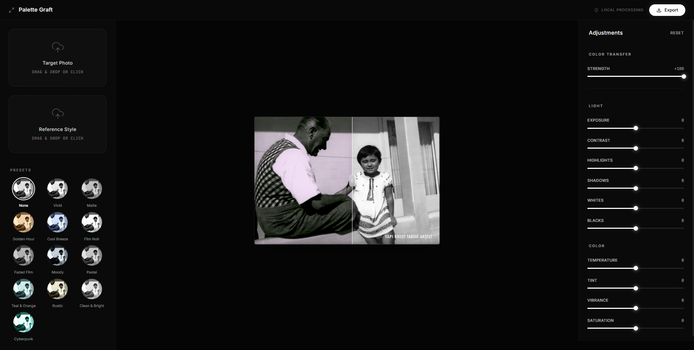

<div align="center">

# 🎨 Palette Graft
### Professional Color Transfer & Photo Adjustment Tool


[](https://vitejs.dev/)
[](https://reactjs.org/)
[](https://www.typescriptlang.org/)
[](https://tailwindcss.com/)

<p align="center">
  
</p>

</div>

[**English**](#english) | [**Türkçe**](#türkçe)

---

<a name="english"></a>

## 🌟 Overview

**Palette Graft** is a high-performance, local-first image processing application designed for professional-grade color transfer. Using the **Reinhard Color Transfer** algorithm, it allows users to "graft" the aesthetic palette of one image onto another with surgical precision, all within the browser.

### 🚀 Key Features

- **⚡ Local-First Processing:** Everything happens in your browser. No images are uploaded to servers.
- **🎨 Palette Grafting:** Advanced Reinhard algorithm for realistic color space matching (LAB Space).
- **🛠️ Professional Controls:** Fine-tune results with Exposure, Contrast, Temperature, Tint, and more.
- **✨ Real-time Preview:** 60 FPS performance thanks to optimized Web Workers and Look-Up Tables (LUT).
- **📱 Responsive Design:** Fully optimized for mobile with touch-enabled split comparison.
- **🌈 Presets:** Quick one-click styles like *Golden Hour*, *Cyberpunk*, and *Film Noir*.

### 🛠️ Technical Implementation

- **Worker Orchestration:** Heavy computations are offloaded to **Web Workers** to keep the UI thread responsive.
- **Performance Optimization:** Uses **Look-Up Tables (LUT)** for expensive sRGB-to-Linear conversions, reducing CPU load.
- **State Management:** Powered by **Zustand** for lightweight and predictable application state.
- **Modern UI:** Built with **Framer Motion** for premium micro-animations and smooth transitions.

---

<a name="türkçe"></a>

## 🌟 Genel Bakış

**Palette Graft**, profesyonel seviyede renk transferi için tasarlanmış, yüksek performanslı ve yerel öncelikli (local-first) bir görsel işleme uygulamasıdır. **Reinhard Renk Transferi** algoritmasını kullanarak, kullanıcıların bir görselin estetik paletini bir başkasına cerrahi hassasiyetle "nakletmesine" olanak tanır.

### 🚀 Öne Çıkan Özellikler

- **⚡ Yerel İşleme:** Her şey tarayıcınızda gerçekleşir. Görselleriniz hiçbir sunucuya yüklenmez.
- **🎨 Renk Nakli:** Gerçekçi renk uzayı eşleşmesi (LAB Space) için gelişmiş Reinhard algoritması.
- **🛠️ Profesyonel Kontroller:** Pozlama, Kontrast, Sıcaklık ve daha fazlasıyla sonuçlara ince ayar yapın.
- **✨ Gerçek Zamanlı Önizleme:** Optimize edilmiş Web Worker'lar ve Look-Up Table (LUT) sayesinde 60 FPS performans.
- **📱 Duyarlı Tasarım:** Dokunmatik slider desteği ile tamamen mobil uyumlu.
- **🌈 Hazır Ayarlar:** *Golden Hour*, *Cyberpunk* ve *Film Noir* gibi tek tıkla uygulanan stiller.

### 🛠️ Teknik Uygulama

- **Worker Orkestrasyonu:** Ağır hesaplamalar, arayüzün akıcılığını bozmamak için **Web Worker**'lara aktarılmıştır.
- **Performans Optimizasyonu:** sRGB-Lineer dönüşümleri için **LUT (Bakup Tabloları)** kullanılarak CPU yükü azaltılmıştır.
- **Durum Yönetimi:** Hafif ve öngörülebilir durum yönetimi için **Zustand** kullanılmıştır.
- **Modern Arayüz:** Premium mikro animasyonlar ve akıcı geçişler için **Framer Motion** tercih edilmiştir.

---

## 💻 Getting Started / Başlangıç

```bash
# Clone the repository / Depoyu klonlayın
git clone https://github.com/woffluon/palette-graft

# Install dependencies / Bağımlılıkları yükleyin
npm install

# Run dev server / Geliştirme sunucusunu başlatın
npm run dev
```

## 📄 License / Lisans

[MIT License](./LICENSE)

